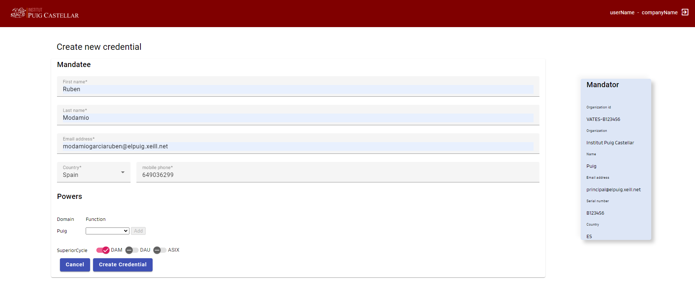
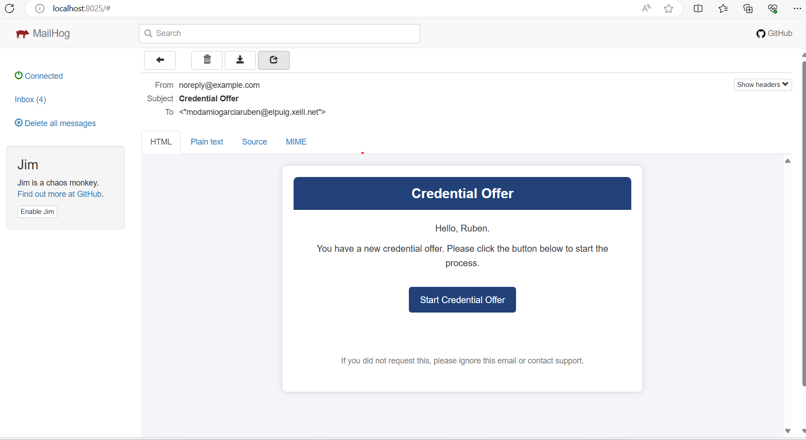
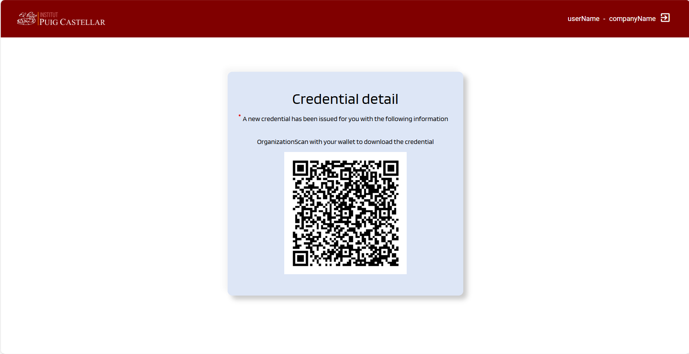
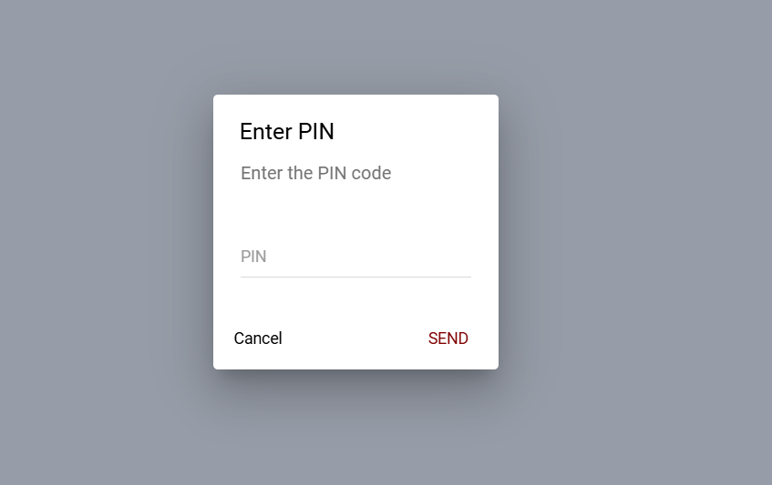
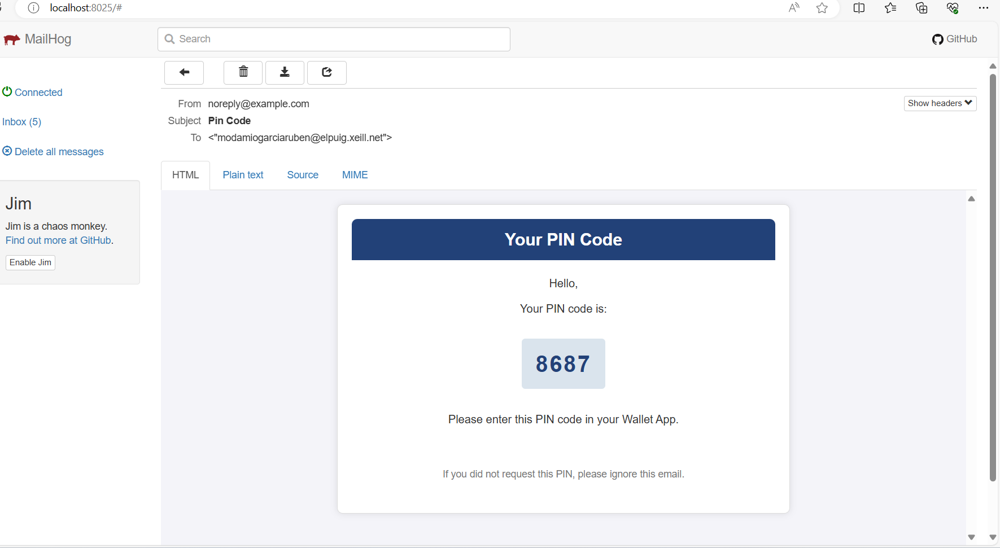
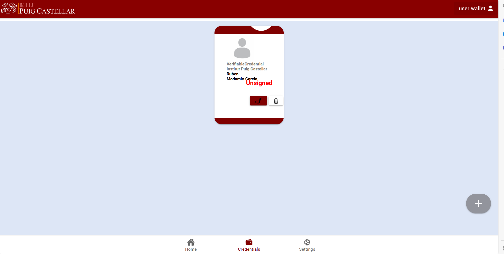
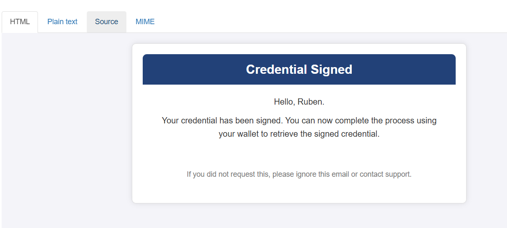
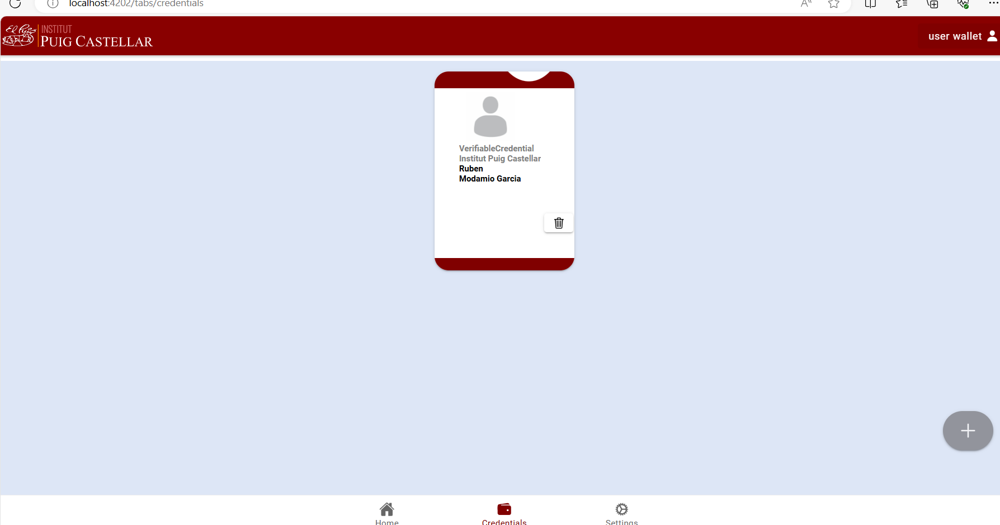

# Step-by-Step Guide for Credential Issuance

## Prerequisites

1) [Docker desktop](https://www.docker.com/products/docker-desktop/).
2) [Postman](https://www.postman.com/downloads/).

## Steps to Follow

### Start the containers:

* Navigate to the root folder of the project.

* Run the command:
```bash
   docker compose up -d
```
* Wait for all containers to initialize correctly.

* Note: Sometimes, Scorpio may throw an error upon initialization. If this occurs, rerun the container.

### Access the services:
* Issuer: http://localhost:4201
* Mail Catcher: http://localhost:8025
* Wallet: http://localhost:4202

### Create the credential:
   * Go to the issuer at http://localhost:4201/credentialIssuance.
   * Complete the form to create the student's credential.
   * The mandator's data is mocked because it should be extracted from the digital certificate used for login (this part is not developed yet).
   * Once the data is entered and the powers (equivalent to higher cycles) are set, click "Create Credential".



### Review the credential offer:
   * Open http://localhost:8025 and view the email with the credential offer.


   * In the link sent to the student, click "Start Credential Offer".
   * This will display a QR code, which you should photograph with your mobile phone.


### Scan the QR with the wallet:
   * Open the wallet at http://localhost:4202 and log in using username **user** and password **user**.
   * Click "Scan QR" and scan the QR code.
   * You will be asked for a PIN found in the mail catcher.



   * Enter the PIN, which will return the credential in "unsigned" status.


### Sign the credential:
   * In the mail catcher, you will see an email notifying the director of a new credential request to be signed.
   * Using Postman or curl, simulate that you are the director and retrieve the pending credentials to sign.
```bash
curl --location 'http://localhost:8081/api/v1/deferred-credentials' \
--header 'X-SSL-Client-Cert: VATES-B123456'
```
   * Sign them using the local signer. First, retrieve a token using the next request:
```bash
curl --location 'localhost:7001/realms/CredentialIssuer/protocol/openid-connect/token' --header 'Content-Type: application/x-www-form-urlencoded' --data-urlencode 'client_id=oidc4vci-wallet-client' --data-urlencode 'username=user' --data-urlencode 'password=user' --data-urlencode 'grant_type=password'
```
   * Then copy the credential and sign it with the following request, replacing the token with the one generated:
```bash
curl --location 'http://localhost:8050/api/v1/signature/sign' \
--header 'Content-Type: application/json' \
--header 'Authorization: Bearer YOUR_TOKEN_HERE' \
--data-raw '{
    "configuration": {
        "type": "JADES"
        },
    "data": "{YOUR_CREDENTIAL_DATA_HERE}"
}'
```
   * Once signed, publish it in the issuer and replace the example with the signed credential:
```bash
curl --location 'http://localhost:8081/api/v1/deferred-credentials' \
--header 'X-SSL-Client-Cert: VATES-B123456' \
--header 'Content-Type: application/json' \
--data '{"credentials" : [
    {"credential": "YOUR_SIGNED_CREDENTIAL_HERE"
    }
]}'
```

### Notification and obtaining the credential:
   * This will generate an email notifying the student that their credential has been signed and can be requested (view this email in the mail catcher).


   * Enter the wallet, and above the credential, click the pen icon to obtain the signed credential.

